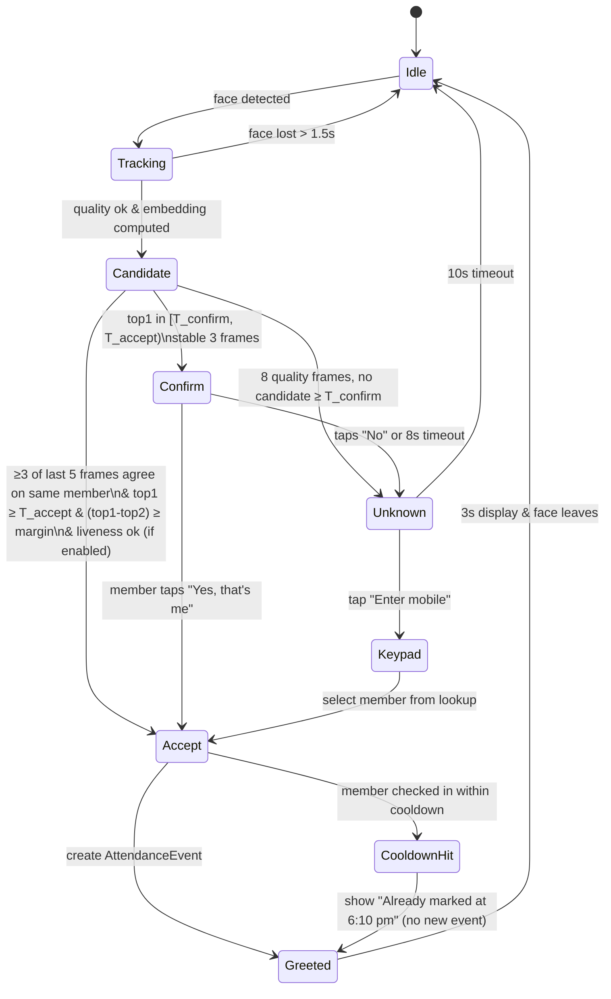
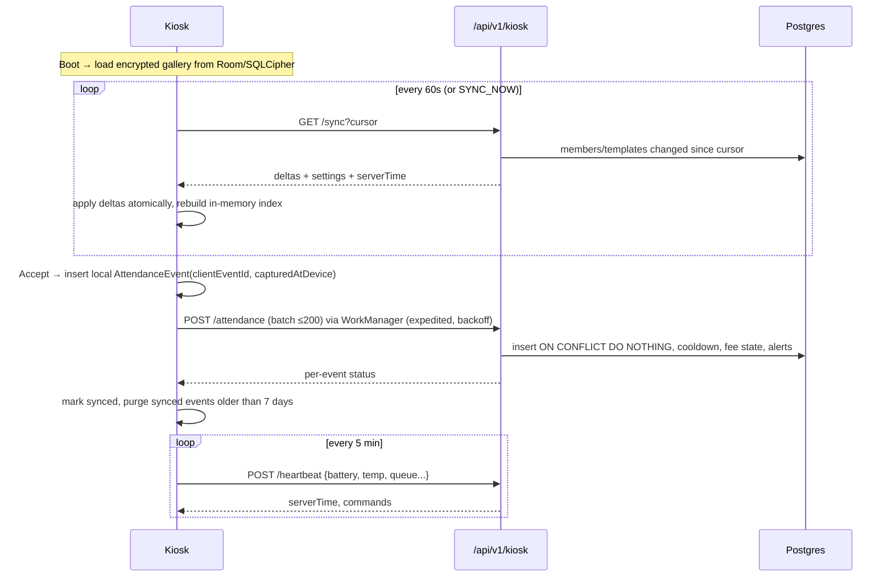

# Max Haazri — Face-Recognition Attendance System

**Constraint from brief:** one Android phone with a working camera at reception; camera always active; member walks up, is recognised automatically, attendance is marked and CRM updates instantly.

---

## 1. Recommendation in one paragraph
Build a **native Kotlin kiosk app** that runs the whole face pipeline **on the phone**: CameraX streams frames → ML Kit detects and tracks faces → a quality gate picks a good frame → the face is aligned and turned into an embedding by a **commercially licensed** face-recognition model (or SDK) → the embedding is matched against the gym's members stored encrypted on the phone → a small decision state machine requires agreement across several frames, applies a liveness check and cooldown → the screen greets the member by name and voice → the event is saved locally and synced to the server within seconds (or later if offline). The phone is locked into kiosk mode, auto-starts on boot, stays cool with adaptive frame rates, and reports health to the CRM.

## 2. Options compared

| Option | Accuracy | Offline | Cost | Privacy | Kiosk reliability | Verdict |
|---|---|---|---|---|---|---|
| **A. Native Android, on-device pipeline, licensed model/SDK** | High (model-dependent) | Full | One-time/annual licence + phone | Biometrics stay on gym device + your server | High (lock task, boot start, CameraX) | **Recommended** |
| B. Native Android, on-device, open research-only weights | High | Full | Free | Same | High | **POC only** — popular pretrained face-recognition weights (e.g., InsightFace model packs) are licensed for non-commercial research; commercial use needs a licence |
| C. Web page on the phone (browser + WASM models) | Medium | Partial | Low | Same | Low (tab throttling, no boot start, permission prompts) | Sales demo only |
| D. Phone streams frames to server; server recognises | High | None | Server GPU/CPU | Frames leave the gym | Medium (network dependent, latency) | Not recommended |
| E. Cloud face API per check-in | High | None | Per-call fees | Third-party processing | Medium | Not recommended |
| F. Dedicated face-attendance terminal (hardware) | High | Full | Hardware purchase | Vendor dependent | High | Out of brief (must be the Android phone), but a fallback if phone path fails |

## 3. Hardware & physical setup

| Item | Recommendation |
|---|---|
| Phone | Mid-range Android 13+ with ≥ 6 GB RAM, good **front camera** (≥ 12 MP), a chipset with GPU/NPU delegate support, and preferably a **battery charge-limit** setting (e.g., "protect battery" type options on several brands — verify on the chosen model). Buy 2 of the same model if budget allows (hot spare + POC device). |
| Mount | Adjustable wall/desk stand; camera centre at **~150 cm** from floor; tilted slightly down; 60–120 cm from where members stop. |
| Position | Facing the entry path so members naturally look at it; **no bright door or window behind the member** (backlight kills recognition). |
| Light | Small LED panel (daylight/neutral, diffused) beside the phone aimed at faces; avoid flicker (choose flicker-free driver). |
| Power | Original charger + surge protector; route cable neatly; optional smart plug schedule (e.g., cut charge 30 min every 4 h) if no charge-limit feature. |
| Network | Gym Wi-Fi; optional 4G SIM as backup. |
| Signage | Floor sticker "Stand here" + small sign "Look at the phone for attendance / हाज़िरी के लिए फोन की ओर देखें" + privacy notice summary with QR to full notice. |
| Enclosure | Anti-theft lockable tablet/phone enclosure with ventilation. |

## 4. Face engine: licensing decision (gate before Phase 7 production)

The pipeline is written against an interface so the engine can be swapped:

```kotlin
interface FaceEngine {
    val modelVersion: String            // e.g. "fe-vendorX-2.1" or "fe-poc-mbf"
    val embeddingSize: Int
    fun detect(frame: ImageProxy): List<DetectedFace>          // may delegate to ML Kit
    fun quality(face: DetectedFace, frame: ImageProxy): QualityResult
    fun embed(face: DetectedFace, frame: ImageProxy): FloatArray // L2-normalised
    fun liveness(face: DetectedFace, frame: ImageProxy): Float?  // null if not supported
}
```

| Path | What to do | Decision owner |
|---|---|---|
| **Licensed on-device SDK** (vendors offering Android face recognition + passive liveness) | Shortlist 2–3 vendors; request trial licences; run the POC protocol (§13) on the real phone at the real spot; compare accuracy, speed, liveness, price, offline licensing (no per-call internet check), data terms. | Founder + Tech lead |
| **Licensed model weights** (e.g., commercial licence for an open model family) | Obtain written commercial licence for the exact weights; convert to TFLite/LiteRT; benchmark. | Founder |
| **Self-trained model** | Only if a clean, commercially usable training dataset licence exists — generally not practical for this project. | — |

Detection via **ML Kit Face Detection** (on-device, free to use under Google's terms) is fine for finding faces and landmarks; ML Kit does **not** do recognition.

**Rule:** no production release on research-only weights. Record the licence, version and terms in `docs/10-delivery/decision-log.md`.

## 5. Pipeline (per frame)

```
CameraX ImageAnalysis (front camera, 640×480 YUV, STRATEGY_KEEP_ONLY_LATEST)
  │  adaptive fps: IDLE 3–5 fps  → ACTIVE 12–15 fps when a face is present
  ▼
[1] Motion/presence check (cheap luma diff on downscaled frame)  — skip heavy work when scene static
  ▼
[2] ML Kit face detection (PERFORMANCE_MODE_FAST, tracking enabled, landmarks on)
  │  choose the LARGEST face (closest person); ignore faces < 110 px inter-ocular-adjusted box
  ▼
[3] Quality gate
  │  yaw |≤ 20°|, pitch |≤ 20°|, roll |≤ 15°|; eyes open prob ≥ 0.4 (if available)
  │  brightness in [60, 200] on face ROI; blur (variance of Laplacian) ≥ threshold (calibrate)
  │  face box fully inside frame; not occluded (landmarks present)
  ▼
[4] Alignment — similarity transform from eye/nose/mouth landmarks to 112×112 canonical template
  ▼
[5] Embedding — engine.embed() on GPU/NNAPI delegate where available; L2 normalise
  ▼
[6] Match — cosine similarity vs in-memory gallery (all ACTIVE templates of eligible members)
  │  per member score = max over that member's templates
  │  top1, top2 (different members)
  ▼
[7] Liveness (every Nth ACTIVE frame or on candidate) — engine.liveness()
  ▼
[8] Decision state machine (§6) → UI + AttendanceEvent
```

Performance budget on a mid-range phone: detection ~15–30 ms, embedding ~20–60 ms, matching < 5 ms for 3,000 vectors. End-to-end target ≤ 1.2 s including multi-frame agreement.

## 6. Decision state machine



Initial parameters (calibrate in shadow mode; values depend on the chosen model):

| Parameter | Start value | Notes |
|---|---|---|
| `T_accept` | model-specific (from vendor or POC ROC at FAR ≤ 0.1%) | Stored in server settings, pushed to kiosk |
| `T_confirm` | T_accept − 0.08 (cosine) | Confirm band |
| `margin` | 0.06 | Guards look-alikes/siblings |
| Frames agreement | 3 of 5 | |
| Cooldown | 180 min | BR-9.1 |
| Unknown timeout | 10 s | |
| Max templates/member | 8 | 1–2 selfie, 3–5 assisted, rest adaptive |

**Shadow mode** (first 2 weeks, setting `shadowMode=true`): every Accept shows the Confirm screen for staff/member tap; logs `(score, decision, confirmed)` to calibrate thresholds. Exit criteria in §13.

## 7. Enrolment

| Source | When | Quality | Process |
|---|---|---|---|
| **Sign-up / QR selfie** | Automatically after registration/approval (member has face consent) | Medium (different camera) | Server creates `EnrollmentJob`; kiosk pulls image (signed URL), runs detection+quality+embed, uploads template (`sourceKind=signup_selfie`), discards image |
| **Assisted enrolment at kiosk** | First visit, or CRM "चेहरा जोड़ें" | High | Staff opens admin → Enrol → searches member → member looks at camera; app captures 5 good frames with slight head turns; uploads 3–5 templates (`assisted`) |
| **Adaptive update** | After a high-confidence Accept (score ≥ T_accept + 0.05), at most 1 per member per 7 days | High | Adds `adaptive` template; evicts oldest adaptive beyond cap. Never from Confirm/Keypad paths (avoids poisoning). |

The kiosk **never stores raw enrolment images** after computing templates. The server keeps the original selfie (profile photo) per retention rules, enabling re-enrolment when the model version changes.

## 8. Sync protocol



- **Clock:** kiosk stores `offset = serverTime − deviceTime` from last heartbeat; `capturedAt = capturedAtDevice + offset` computed server-side too.
- **Conflict rules:** server is authoritative on eligibility; a `INELIGIBLE` result (e.g., member left minutes ago) voids nothing on device but is recorded server-side as rejected.
- **Offline:** unlimited local queue (bounded by storage; alert at 5,000 events). Gallery continues working with last synced data.

## 9. Kiosk hardening (Android)

| Need | Implementation |
|---|---|
| Locked single app | Provision as **Device Owner** (factory reset → `adb shell dpm set-device-owner in.maxfitness.haazri/.kiosk.AdminReceiver`) → `startLockTask()` with lock-task packages = app only; disable status bar & keyguard via `DevicePolicyManager` |
| Auto start | `RECEIVE_BOOT_COMPLETED` receiver + Device Owner persistent preferred activity (HOME intent) |
| Screen on | `FLAG_KEEP_SCREEN_ON`; idle dim to 20% brightness after 2 min without faces; wake on motion |
| Crash recovery | Uncaught exception handler → restart activity; watchdog `WorkManager` periodic check |
| Thermal | Listen to `PowerManager` thermal status; drop fps / pause liveness at `THERMAL_STATUS_MODERATE`; alert at `SEVERE` |
| Burn-in | Idle screen shifts content position every minute; avoid static bright elements |
| Updates | Private distribution: app checks `/kiosk/heartbeat` for `latestVersion`; staff installs via admin screen (or MDM later). Device Owner allows silent install via `PackageInstaller` session — implement in 1.1 |
| Admin exit | Long-press logo 5 s → owner PIN (verified offline against hashed PIN pushed in settings) → admin screen (enrol, sync, settings, exit lock task, unpair) |
| Data at rest | Room + SQLCipher; DB key wrapped by Android Keystore; device token in EncryptedSharedPreferences/DataStore with Keystore key |
| Unpair/wipe | CRM revoke → `WIPE_AND_UNPAIR` command → delete DB, keys, token |
| Network security | HTTPS only, `network_security_config` without cleartext; optional certificate pinning to Caddy's issuer (plan rotation) |
| Permissions | Camera only (+ boot, network, foreground service). No storage/location. |

## 10. Kiosk UX & voice

| State | Screen | Voice (hi-IN TTS, default) |
|---|---|---|
| Idle | Dim logo, "हाज़िरी के लिए कैमरे की ओर देखें", small "New? Scan to join" QR | — |
| Welcome (PAID) | Green, photo, "नमस्ते संजय जी ✓", "23 दिन बाकी" | "नमस्ते संजय जी, हाज़िरी लग गई" |
| Welcome (DUE_SOON) | Green with amber strip "3 दिन बाकी — रिसेप्शन पर रिन्यू करें" | "संजय जी, आपकी फीस 3 दिन में खत्म होगी" (optional setting) |
| EXPIRED | Amber, photo, "संजय जी, कृपया रिसेप्शन पर मिलें" | "संजय जी, कृपया रिसेप्शन पर मिलें" |
| Already marked | Blue, "आज 6:10 बजे हाज़िरी लग चुकी है" | — |
| Confirm | Blue, photo, "क्या आप संजय तोमर हैं?" [हाँ] [नहीं] | "क्या आप संजय जी हैं?" |
| Unknown | Navy, "पहचान नहीं हुई" [मोबाइल नंबर डालें] + join QR | — |
| Keypad | Big numeric keypad → up to 4 photo candidates → tap own photo | — |
| Offline badge | Small amber cloud icon top-right | — |

Never display fee amounts or other members' details on the kiosk.

## 11. Privacy & compliance (summary; details in `docs/07-security-compliance/`)
- Face attendance is **opt-in** with a standalone notice; manual attendance is the alternative.
- Templates only for eligible members; excluded: no consent, minors without guardian consent, `LEFT`/`BLOCKED`.
- Consent withdrawal → templates revoked at next sync (≤ 60 s online) and deleted server-side per retention.
- No video recording. Optional check-in snapshots are **off** by default (setting, max 7 days).
- Visible signage at reception.

## 12. Failure handling
| Situation | Behaviour |
|---|---|
| Camera error | Show "हाज़िरी फ़ोन में दिक्कत — स्टाफ को बताएँ"; heartbeat `cameraOk=false` → CRM alert |
| Server unreachable | Continue offline; badge; queue |
| Gallery empty (not yet synced) | Keypad-only mode |
| Twins / look-alikes | Margin rule → Confirm; staff can mark "look-alike pair" to force Confirm for both |
| Mask/helmet/cap | Quality gate fails → prompt "टोपी/मास्क हटाएँ" after 3 s |
| Group arrives together | Process largest face; others queue naturally as they step forward; Greeted screen lasts 2 s in crowd mode (queue > 1 face) |

## 13. POC protocol (Phase 1b, runs in parallel with Phase 1) — go/no-go

**Setup:** actual phone model, actual reception spot, actual evening lighting, LED panel on/off comparisons.
**Participants:** 30–40 consenting members/staff, both genders, varied ages, glasses/beards/headscarves represented.
**Procedure:**
1. Enrol each via (a) phone selfie only, (b) assisted 5-frame enrolment.
2. Each walks up naturally 5 times over 3 days (morning, evening).
3. Impostor test: non-enrolled volunteers (≥ 20) walk up 3 times each.
4. Spoof test: printed photo and phone-screen photo of 10 enrolled members.
5. Log every attempt with scores.

**Metrics & targets:**
| Metric | Target |
|---|---|
| True accept rate (assisted enrolment) at chosen threshold | ≥ 97% |
| True accept rate (selfie-only enrolment) | ≥ 85% (improves via adaptive + first-visit assisted) |
| False accept rate (wrong member accepted) | ≤ 0.1% of impostor attempts; zero in test set |
| Median time to greeting | ≤ 1.2 s |
| Spoof acceptance with liveness on | 0 in test set |
| Device temperature after 4 h continuous | ≤ 42 °C |

**Go/no-go:** meet targets with a licensable engine → proceed to Phase 7. If accuracy fails due to lighting → fix physical setup and retest. If no licensable engine meets targets within budget → fall back to **keypad + photo confirm** attendance on the same phone (still useful), revisit in 1.1.

## 14. Acceptance tests (production)
- 24 h offline test: 300 synthetic events queued, zero loss after reconnect, no duplicates.
- Reboot test: power cut → app back in kiosk mode within 90 s without human action.
- Revocation test: revoke face consent in CRM → member not recognised within 2 min.
- Cooldown test: same member 3 times in 10 min → one event.
- Expired member test: owner alert within 60 s of check-in (online).
- 8 h soak test at 12 fps active / 4 fps idle: no memory growth > 10%, no crash.
