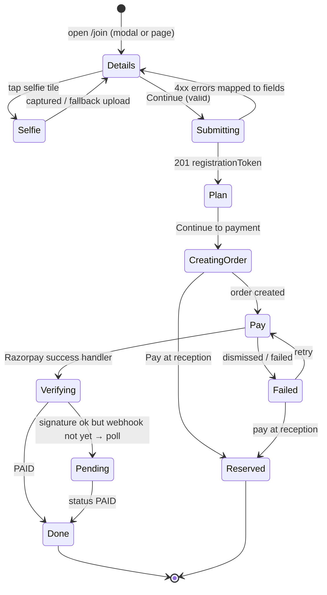

# Sign-up, Selfie & Payment Flow — Technical Spec

PRD: SU-01…12, PAY-01…10 · Wireframes: `docs/03-design/landing-page-wireframes.md` · Copy: `website-copy-deck.md`.

## 1. Flow & state



Client state persisted in `sessionStorage` key `mfp_join` (registrationToken, selected plan, start date) so refresh doesn't lose progress. No personal data in `localStorage`.

## 2. Selfie capture component (`components/join/SelfieCapture.tsx`)

### 2.1 Capability detection
```ts
const hasMedia = !!navigator.mediaDevices?.getUserMedia;
const isSecure = window.isSecureContext;                 // HTTPS or localhost required
const inApp = /Instagram|FBAN|FBAV|WhatsApp|Line\//i.test(navigator.userAgent);
```
- `!isSecure || !hasMedia` → fallback input.
- `inApp` → show "Open in Chrome" banner, still try camera.

### 2.2 Permission & stream
1. Show explainer sheet first (why camera, what happens) → button "Open camera".
2. `getUserMedia({ video: { facingMode: 'user', width: { ideal: 1280 }, height: { ideal: 720 } }, audio: false })`.
3. Attach to `<video playsInline muted autoPlay>`; mirror preview with CSS `scaleX(-1)` (capture un-mirrored).
4. Errors: `NotAllowedError` → denied UI; `NotFoundError` → no camera → fallback; `NotReadableError` → "Camera is in use by another app"; `OverconstrainedError` → retry with `{ video: true }`.
5. Always stop tracks on close/unmount.

### 2.3 Face presence check (client)
- Lazy-load MediaPipe Tasks Vision `FaceDetector` (short-range model, WASM, self-hosted assets under `/public/mediapipe/`) only when the sheet opens.
- Run detection at ~5 fps on the video; require exactly **1 face**, box width ≥ 35% of frame, centred within the oval guide, for 500 ms → enable "Take photo".
- If the model fails to load within 4 s → allow capture without check (server re-validates later/optional).

### 2.4 Capture & compress
- Draw current frame to canvas (crop to square around face box with 40% padding), resize to 720×720, `canvas.toBlob('image/jpeg', 0.85)`; target ≤ 300 KB (retry at 0.75 if larger).
- Preview → "Use this photo" / "Retake".

### 2.5 Fallback
`<input type="file" accept="image/*" capture="user">` → same compress pipeline via `createImageBitmap` (respect EXIF orientation with `imageOrientation: 'from-image'`).

### 2.6 Server-side processing (`POST /registrations`)
- Validate MIME by magic bytes (JPEG/PNG/WebP/HEIC → reject HEIC with helpful message or convert if `sharp` build supports).
- `sharp(input).rotate().resize(720, 720, { fit: 'cover' }).jpeg({ quality: 85, mozjpeg: true })` → strips metadata by default.
- SHA-256, store under `selfies/{gymId}/{memberId}/{cuid}.jpg`, create `MediaFile(kind=SELFIE)`.
- If member has face consent → `EnrollmentJob` created **after payment confirmation / verification approval**, not at registration (avoid enrolling unpaid sign-ups).

## 3. Validation (shared Zod `RegistrationInput`)
| Field | Rule |
|---|---|
| fullName | trim, 2–60 chars, letters/spaces/.'- in Latin or Devanagari |
| mobile | normalise → `^[6-9]\d{9}$` → E.164 |
| email | valid, ≤ 120, lowercased |
| dob | real date, age ≥ `minAge` (16), ≤ 90 |
| gender | MALE / FEMALE (OTHER behind setting) |
| consents.terms, consents.privacy | must be true |
| consents.whatsappUpdates | boolean (warn if false) |
| consents.faceAttendance | boolean, default false; forced false if minor |
| selfie | required, ≤ 2 MB upload |

## 4. Order creation (`POST /checkout/orders`)
1. Verify token → load member (`PENDING_PAYMENT` or renew-eligible).
2. Load plan (must match member gender; OTHER per BR-2.5).
3. Compute `startDate` (BR-3.3 / BR-3.4 for renewals) and `endDate` (BR-3.1) in core.
4. Compute amount = plan price + admission fee if first membership (BR-2.6).
5. Transaction: create `Membership(PENDING_PAYMENT)` (or reuse existing pending one for same plan/start), `Payment(CREATED, method=RAZORPAY)`.
6. Razorpay `orders.create({ amount, currency: 'INR', receipt: payment.id, notes: { memberId, membershipId, gym: slug } })` → save `providerOrderId`.
7. Return checkout options.

Client opens Razorpay Checkout (script `https://checkout.razorpay.com/v1/checkout.js`, loaded on the pay step only) with `order_id`, `name: "Max Fitness Gym"`, `prefill`, `theme.color: #D62828`, `handler` → `/checkout/verify`, `modal.ondismiss` → Failed state.

## 5. Payment confirmation (single function used by verify + webhook)
```ts
async function confirmPayment({ providerOrderId, providerPaymentId, source }) {
  return db.$transaction(async tx => {
    const p = await tx.payment.findUnique({ where: { providerOrderId }, /* FOR UPDATE via raw */ });
    if (!p) throw new DomainError('NOT_FOUND');
    if (p.status === 'PAID') return result(p);                       // idempotent
    // optional: fetch payment from Razorpay API to confirm amount & status=captured
    const receiptNo = await nextReceiptNo(tx, p.gymId, fyOf(today));
    await tx.payment.update({ where: { id: p.id }, data: { status: 'PAID', providerPaymentId, paidAt: now, receiptNo, providerSignatureOk: source === 'checkout' } });
    await tx.membership.update({ where: { id: p.membershipId }, data: { status: 'CONFIRMED', confirmedAt: now } });
    await activateMember(tx, p.memberId);                            // status ACTIVE, memberCode if missing
    await closeCallTasks(tx, p.memberId, ['SIGNUP_NOT_PAID','EXPIRED_NOT_RENEWED','DUE_SOON_NO_RESPONSE','EXPIRED_BUT_VISITING']);
    await outbox(tx, 'whatsapp.receipt', { paymentId: p.id }, `receipt:${p.id}`);
    await outbox(tx, 'receipt.pdf', { paymentId: p.id }, `pdf:${p.id}`);
    await outbox(tx, 'kiosk.enroll_if_needed', { memberId: p.memberId }, `enroll:${p.memberId}`);
    await outbox(tx, 'alert.owner.payment', { paymentId: p.id }, `alertpay:${p.id}`);
    return result(p);
  });
}
```
Amount check: webhook `payload.payment.entity.amount` must equal `Payment.amountPaise`; mismatch → flag + alert, don't activate.

## 6. Pay at reception
- Membership `PENDING_PAYMENT` with `reservedUntil = now + 48h` (settings); member `PENDING_PAYMENT`.
- Appears in CRM Fees → "Pending payment" with [₹ फीस लें] → desk payment flow → `confirmDeskPayment()` shares the same activation steps.
- After 24 h unpaid → call task `SIGNUP_NOT_PAID`; after 7 days → membership `CANCELLED`, member remains as lead-like record.

## 7. Receipt
- `receipt.pdf` job renders A5 PDF with gym details, receipt no, member code, plan, dates, amount in figures and words (Indian system), method, "This is a computer-generated receipt."
- Public view `/r/[token]` shows HTML receipt + download.

## 8. DEMO_MODE
- `provider=simulated`: "Pay" opens an in-app dialog with **Simulate success** / **Simulate failure**, which calls the same `confirmPayment` path with `method=SIMULATED`.

## 9. Analytics & error logging
Events per PRD §7; Sentry breadcrumbs without PII; selfie failures tagged by reason (`denied`, `no_camera`, `in_app`, `no_face`, `model_load_timeout`).
