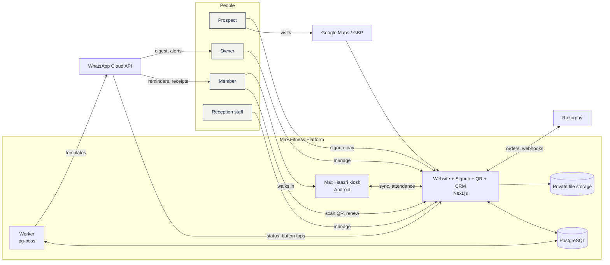
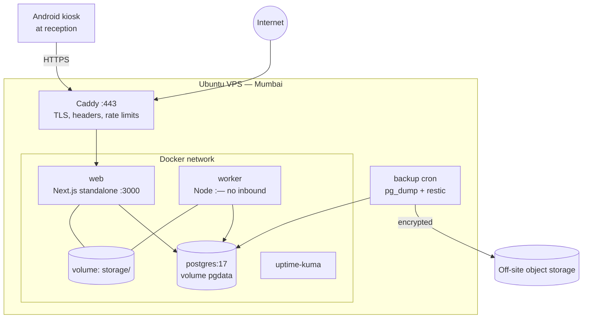
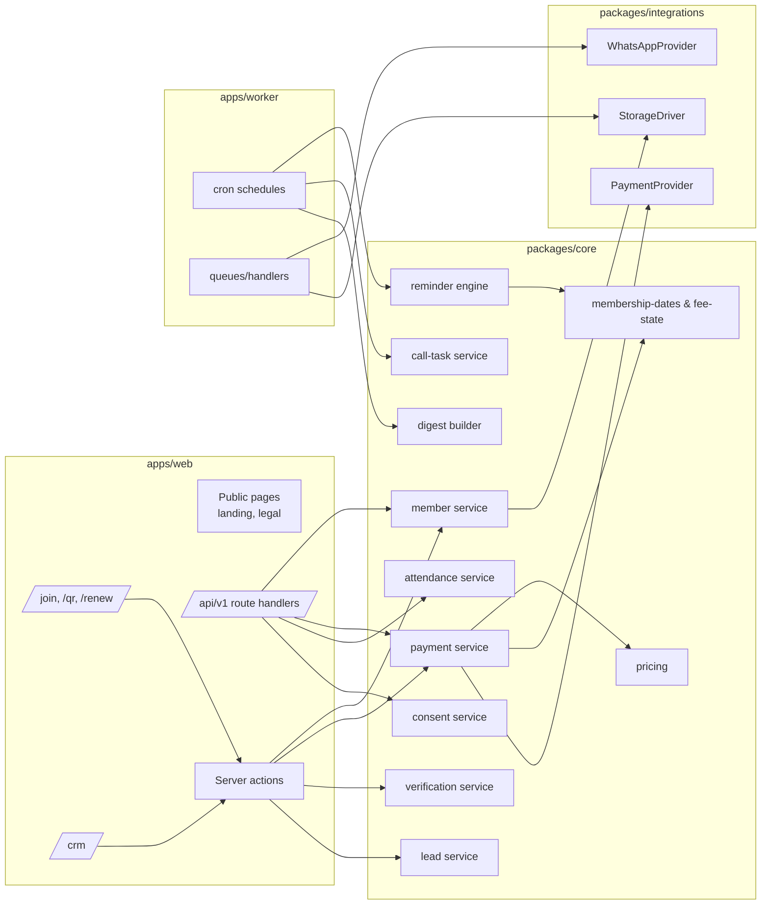

# System Architecture

Diagrams use Mermaid (renders on GitHub, VS Code with Mermaid extension, and most Markdown viewers). More sequences and state machines: `docs/06-diagrams/diagrams.md`.

## 1. System context

## 2. Containers (deployment units)

Only ports 80/443 (Caddy) and SSH (key-only, restricted) are open. Postgres is never exposed.

## 3. Logical components

Rule: arrows only point **into** `packages/core` from apps, and from core to integrations **through interfaces** injected at the app boundary.

## 4. Key data flows

### 4.1 Online sign-up and payment
1. Browser posts details + selfie (`multipart/form-data`) to `POST /api/v1/registrations`.
2. Server validates (Zod), processes image (sharp: 720px JPEG, EXIF stripped), stores privately, creates `Member(PENDING_PAYMENT)`, `Consent` rows, returns `registrationToken`.
3. Plan screen `GET /api/v1/plans?gender=` → `POST /api/v1/checkout/orders { registrationToken, planId, startDate }` → server computes amount & dates via `packages/core`, creates `Membership(PENDING_PAYMENT)`, `Payment(CREATED)`, Razorpay order (receipt = payment id), returns order id + key id.
4. Razorpay Checkout completes → browser posts `{ razorpay_order_id, razorpay_payment_id, razorpay_signature }` to `POST /api/v1/checkout/verify` → HMAC verified → payment marked `PAID` (idempotent) → membership `CONFIRMED` → member `ACTIVE` → outbox: receipt, welcome, kiosk enrolment job, owner alert.
5. Webhook `payment.captured`/`order.paid` arrives (possibly before step 4) → same idempotent `confirmPayment()` path.

### 4.2 Reminder slot evaluation
1. pg-boss cron fires at each distinct slot time (e.g., 09:30, 10:00, 14:00, 19:00 IST).
2. `ReminderEngine.planSlot(today, slot)` queries candidate memberships whose `endDate` matches any enabled rule offset for that slot (single SQL with `endDate IN (...)` plus post-expiry range).
3. For each candidate → enqueue `whatsapp.send` with idempotency key.
4. Send handler re-checks eligibility (BR-5.3) inside a short transaction, inserts `MessageLog(QUEUED)` (unique key prevents duplicates), calls provider, updates to `SENT` with `wamid`.
5. Webhook status updates `DELIVERED/READ/FAILED`.

### 4.3 Unsubscribe
Webhook inbound `button` with payload `UNSUB.<token>` → verify HMAC → `MemberService.unsubscribe(memberId)` transaction (BR-6.2) → free-form confirmation with Restart button → owner alert + call task.

### 4.4 Attendance
Kiosk detects & recognises on-device → writes `AttendanceEvent` locally → WorkManager uploads batch → `AttendanceService.ingest()` dedupes by `clientEventId`, applies cooldown, computes fee state → if `EXPIRED` create call task + owner alert → CRM "Came today" updates (TanStack Query refetch / 30 s polling on Home).

### 4.5 QR existing customer
`/qr/existing` → OTP (optional) → form → `POST /api/v1/qr/existing` → `Member(PENDING_VERIFICATION)` + `VerificationRequest(PENDING)` → CRM Verify → approve → membership created, member `ACTIVE`, reminders eligible from next slot, enrolment job.

## 5. Outbox pattern
Side effects must not fire if the transaction rolls back, and must not be lost if the process crashes after commit.
- In the same DB transaction as the state change, insert `OutboxEvent { type, payload, dedupeKey }`.
- Worker polls `OutboxEvent` every 2 s (or uses pg-boss `send` within the transaction via the same client) → dispatches to queues → marks processed.
- Handlers are idempotent.

## 6. Security boundaries
| Zone | Who | Auth |
|---|---|---|
| Public web | anyone | none; rate limits; bot checks on forms |
| Registration continuation | registrant | signed short-lived `registrationToken` |
| Renew/receipt links | member | signed token (member-scoped, expiring) |
| CRM | owner/staff | session cookie + role permissions; PIN re-prompt for sensitive actions |
| Kiosk API | paired device | bearer device token (hashed at rest), scope `kiosk:*`, revocable |
| Webhooks | Razorpay/Meta | HMAC signature over raw body; replay-safe via event id |
| Worker | internal | no inbound ports |

## 7. Failure modes & responses
| Failure | Effect | Response |
|---|---|---|
| Internet down at gym | Kiosk can't sync | Offline queue; CRM alert after 30 min; manual marks later |
| VPS down | Website/CRM/reminders stop | Uptime alert; restart policy; rebuild from IaC + restore < 4 h; reminder catch-up same day |
| WhatsApp API errors (rate/quality) | Messages fail | Retries with backoff (3×); FAILED logged; auto-pause on quality downgrade; owner/vendor alert |
| Razorpay webhook delayed | Payment pending on UI | Client verify path + polling `GET /api/v1/checkout/status` |
| Duplicate webhook | — | Unique constraints make it a no-op |
| Clock skew on kiosk | Wrong attendance times | Server returns time on heartbeat; kiosk stores offset and corrects `capturedAt` |
| Face engine uncertain | Wrong/no match | Confirm prompt band; keypad fallback; manual mark |
