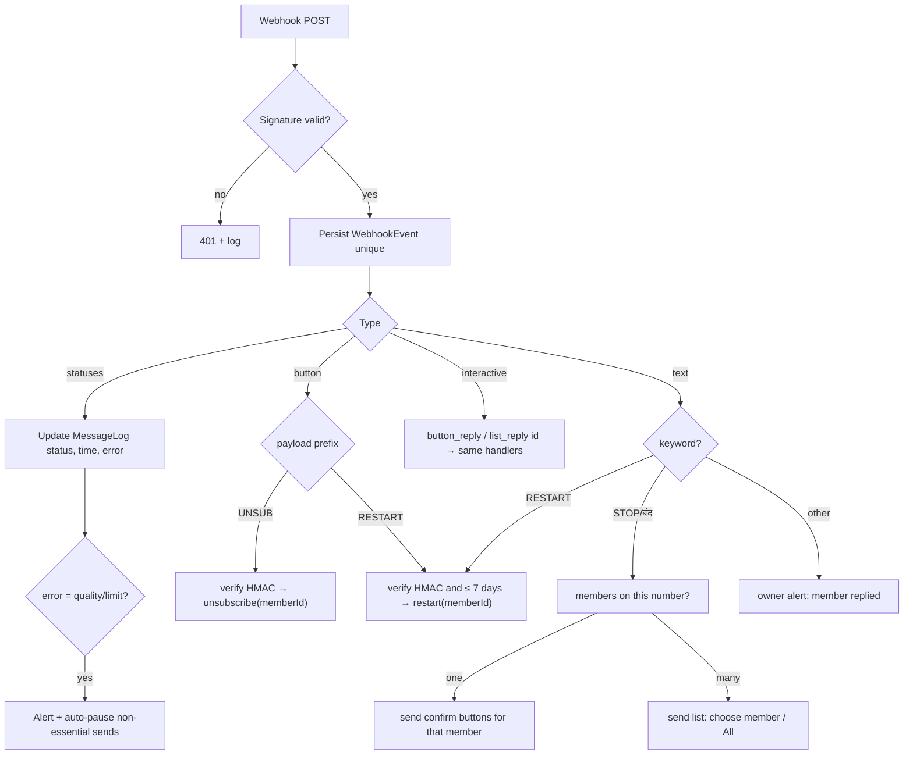

# WhatsApp Automation Engine

Implements PRD `WA-01…WA-15` and business rules BR-5, BR-6. Templates: `docs/04-content/whatsapp-templates.md`.

## 1. Timeline for one member (defaults)

```
 endDate = E (last valid day)

 E-7        E-3     E-2     E-1      E          E+1 … E+7                  E+7 end
  │          │       │       │       │           │                          │
 10:00      10:00   10:00   10:00   10:00     09:30 · 14:00 · 19:00 daily   stop auto → call list
 renewal    renewal renewal renewal ends     membership expired (3/day)
 due        due     due     due     today
                                                ▲ E+3: call task EXPIRED_NOT_RENEWED
 Any renewal (online or desk) at any point → next slot finds a newer membership → nothing sent.
 Unsubscribe tapped at any point → status LEFT → nothing sent ever again (unless re-joins).
```

## 2. Why slot evaluation (not per-member scheduled jobs)
Pre-scheduling "send at E−7 10:00" jobs per member means every renewal, date edit, pause, unsubscribe or price change must find and cancel jobs — a common source of wrong reminders. Instead, at each slot the engine asks the database "who qualifies **right now**?". State changes take effect automatically at the next slot, and eligibility is checked again immediately before each send.

## 3. Components

| Component | Location | Responsibility |
|---|---|---|
| `ReminderRule` table | DB | Codes, offsets, slots, template names, enabled flags |
| `reminders/rules.ts` | core | Load & validate rules; derive distinct slot times |
| `reminders/engine.ts` | core | `planSlot(gymId, today, slot) → SendIntent[]` (pure given repository) |
| `reminders/eligibility.ts` | core | `isEligible(member, membership, rule, now) → { ok, reason }` |
| `jobs/reminder-slot.ts` | worker | Cron per slot → `planSlot` → enqueue `whatsapp.send` |
| `jobs/whatsapp-send.ts` | worker | Re-check eligibility, insert MessageLog (unique key), call provider, update |
| `jobs/whatsapp-inbound.ts` | worker | Statuses, button payloads, keywords, quality events |
| `WhatsAppProvider` | integrations | `sendTemplate`, `sendText`, `sendInteractiveButtons` for `meta_cloud`, `bsp`, `simulator` |
| Message Simulator | web `/crm/messages` | DEMO timeline + time travel |

## 4. Scheduling
- Worker registers one pg-boss cron per distinct slot across enabled rules, in `Asia/Kolkata`:
  - `30 9 * * *` → slot `09:30`
  - `0 10 * * *` → `10:00`
  - `0 14 * * *` → `14:00`
  - `0 19 * * *` → `19:00`
- On settings change (slot times edited), worker reloads schedules (listens to `settings.updated` outbox event or checks hash every 5 min).
- **Catch-up:** on boot, for each slot earlier today whose `JobRun` row (`jobName='reminder-slot'`, `runKey='{date}@{slot}'`) is missing, run it if current time is still within quiet hours (BR-5.5).

## 5. Algorithm

```ts
// packages/core/src/reminders/engine.ts (sketch)
export async function planSlot(deps: Deps, gymId: string, today: ISTDate, slot: SlotTime): Promise<SendIntent[]> {
  const settings = await deps.settings.get(gymId);
  const rules = (await deps.rules.enabledForSlot(gymId, slot)).map(r => withCap(r, settings.postExpiryMaxDays));
  const candidates = await deps.repo.reminderCandidates(gymId, today, slot, rules); // SQL in database-design §4.2
  return candidates.map(c => ({
    idempotencyKey: `rem:${c.memberId}:${c.membershipId}:${c.ruleCode}:${today}:${slot}`,
    memberId: c.memberId,
    membershipId: c.membershipId,
    ruleCode: c.ruleCode,
    templateName: c.templateName,
    language: c.language,
    variables: buildVariables(c, today),        // first name, formatted end date, relative phrase
    buttons: {
      renewUrlToken: deps.tokens.renew(c.memberId, { ttlDays: 30 }),
      unsubscribePayload: deps.tokens.payload('UNSUB', c.memberId, c.membershipId),
    },
  }));
}
```

```ts
// apps/worker/src/jobs/whatsapp-send.ts (sketch)
export async function handle(intent: SendIntent) {
  const now = clock.now();
  const ctx = await repo.loadSendContext(intent.memberId, intent.membershipId);
  const check = isEligible(ctx, intent.ruleCode, now, settings);    // BR-5.3
  const inserted = await repo.insertMessageLogIfAbsent({ ...intent, status: check.ok ? 'QUEUED' : 'SKIPPED', errorCode: check.reason });
  if (!inserted || !check.ok) return;
  try {
    const res = await whatsapp.sendTemplate({ to: ctx.mobile, template: intent.templateName, language: intent.language, variables: intent.variables, buttons: intent.buttons });
    await repo.markSent(inserted.id, res.providerMessageId, now);
  } catch (e) {
    await repo.markFailed(inserted.id, classify(e));
    if (isRetryable(e)) throw e;                                      // pg-boss retry (3, backoff 60s → 5m → 15m) within quiet hours
  }
}
```

Relative phrase for `{{3}}`: `-7 → "in 7 days"/"7 दिन बाद"`, `-3/-2 → "in N days"`, `-1 → "tomorrow"/"कल"`.

## 6. Cloud API request shape (template with buttons)

```json
POST https://graph.facebook.com/{version}/{phone-number-id}/messages
{
  "messaging_product": "whatsapp",
  "to": "919876543210",
  "type": "template",
  "template": {
    "name": "mf_renewal_due",
    "language": { "code": "hi" },
    "components": [
      { "type": "body", "parameters": [
        { "type": "text", "text": "संजय" },
        { "type": "text", "text": "15 सितंबर 2026" },
        { "type": "text", "text": "3 दिन बाद" } ] },
      { "type": "button", "sub_type": "url", "index": "0",
        "parameters": [ { "type": "text", "text": "<renewToken>" } ] },
      { "type": "button", "sub_type": "quick_reply", "index": "1",
        "parameters": [ { "type": "payload", "payload": "UNSUB.<token>.<hmac>" } ] }
    ]
  }
}
```
Pin `{version}` in env; verify field names against the current Cloud API docs when implementing.

## 7. Inbound handling



Unsubscribe transaction (BR-6.2):
```
BEGIN
  UPDATE Member SET remindersUnsubscribedAt=now(), status='LEFT', leftReason='WHATSAPP_UNSUBSCRIBE', leftAt=today WHERE id=$1 AND remindersUnsubscribedAt IS NULL
  -- if 0 rows: already unsubscribed → idempotent exit (still reply confirmation once)
  INSERT CallTask(reason='UNSUBSCRIBED', priority=6) ON CONFLICT DO NOTHING
  INSERT Alert(type='MEMBER_UNSUBSCRIBED')
  INSERT AuditLog(action='member.unsubscribed', actorType='member')
  INSERT OutboxEvent(type='whatsapp.unsubscribe_confirm', dedupeKey='unsubconf:'||$1||':'||date)
  INSERT OutboxEvent(type='kiosk.gallery_changed')
COMMIT
```

## 8. Other automated messages
| Trigger | Template | Category | Timing |
|---|---|---|---|
| Payment `PAID` | `mf_payment_receipt` | Utility | Immediate (quiet hours don't apply to receipts the user just triggered) |
| First confirmed membership | `mf_welcome_member` | Utility | Immediate after receipt (5 s delay) |
| Verification approved | `mf_verification_approved` | Utility | Immediate |
| OTP | `mf_login_code` | Authentication | Immediate |
| Owner digest | `mf_owner_daily_digest` | Utility | 08:30 |
| Owner alerts | `mf_owner_alert_*` | Utility | Immediate, bundled if > 3 within 5 min |
| Birthday | `mf_birthday_wish` | Marketing | Owner-triggered, 09:00–20:00 |

## 9. Safeguards
- **Quiet hours** 08:00–21:00 IST for reminders/birthdays.
- **Per-number daily cap**: max 4 reminder messages per phone number per day across all members sharing it (families) — extra reminders merged: send one message naming the first member, and log others as `SKIPPED:NUMBER_CAP` (setting).
- **Quality guard**: if Meta signals quality downgrade or messaging limit issues → pause `POST` rule automatically, keep `PRE_*` and receipts, alert owner & vendor.
- **Failure guard**: if > 20% of sends in a slot fail → stop the slot, alert.
- **Kill switch**: Settings → "Stop all automatic messages" (owner PIN).
- **DEMO_MODE**: provider = simulator unless number in allowlist.

## 10. Message Simulator (demo & QA)
- Shows, for the next 30 days, a timeline per day and slot of messages the engine **would** send given current data (runs `planSlot` against future dates, read-only).
- "Advance time" (non-production only) moves the fake clock by N days, executes slots, and renders sent messages in WhatsApp-style bubbles, including tappable **Renew now** and **Unsubscribe** buttons that call the real handlers with simulated inbound events. This lets the client watch the full journey in minutes.

## 11. Cost estimate (illustrative, verify current rate card)
Assume 250 active members, ~70 memberships ending per month (mix of monthly and packages), 75% renew before expiry (avg 2.5 reminders each), 25% don't (5 pre-expiry + 7 post-expiry — one a day for the 7-day cap, ADR-068; half unsubscribe or renew by day +3 → avg 4).
- Reminders: 52×2.5 + 18×(5+4) ≈ 292 utility messages
- Receipts + welcome + verification: ≈ 110
- Owner digest + alerts: ≈ 90
- Total ≈ 500 utility messages/month → at roughly ₹0.12 each, **well under ₹150/month plus GST** in Meta fees (BSP platform fees extra if a BSP is used). Birthday marketing messages add a small amount.

## 12. Tests (must exist before enabling live sends)
See `docs/08-quality/testing-strategy.md` §4 matrix: offsets incl. month-end and leap years, renewal mid-sequence, unsubscribe mid-day between slots, shared phone numbers, pause-until, quiet hours, catch-up after downtime, idempotent duplicate cron fire, cap null vs 7, language selection, token tampering.
