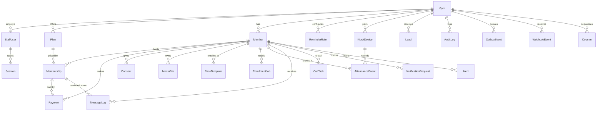
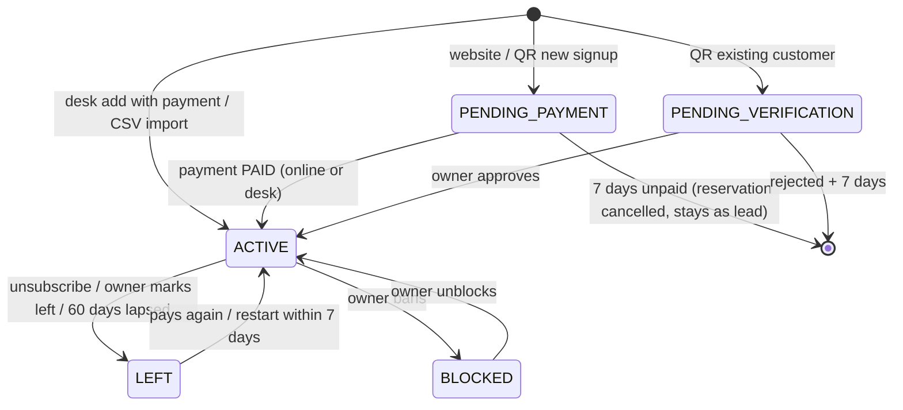
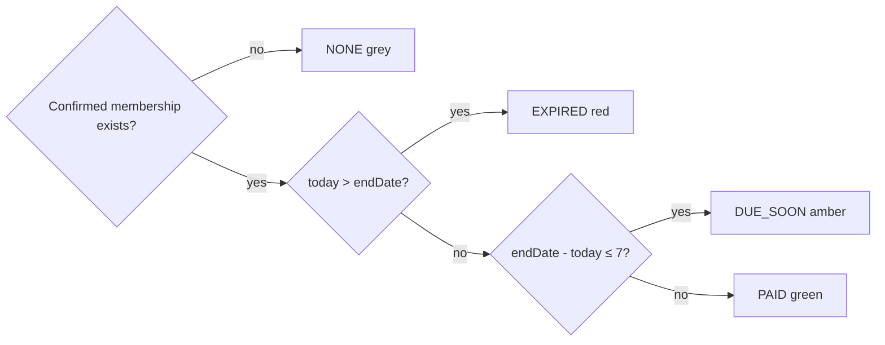
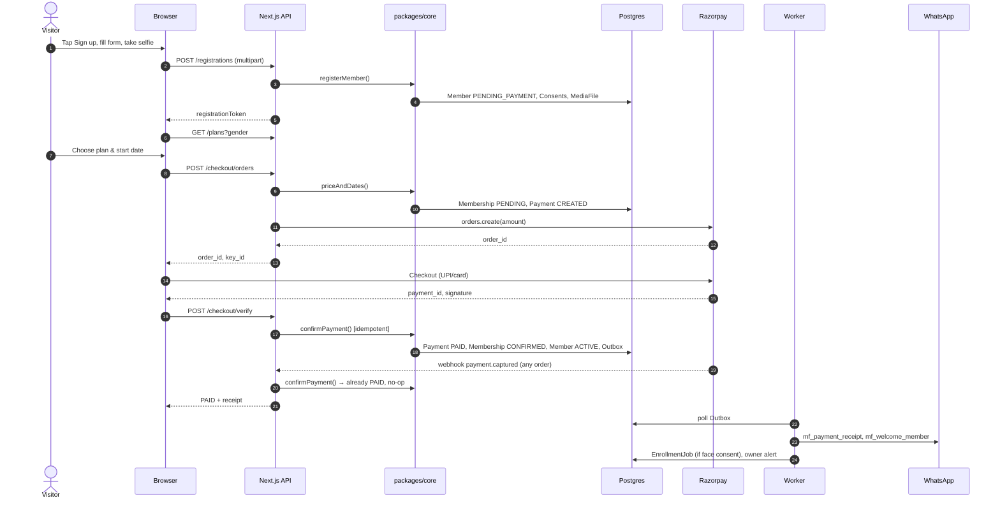
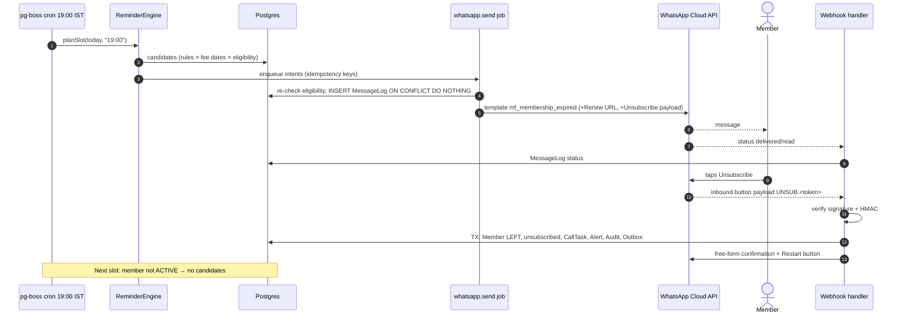
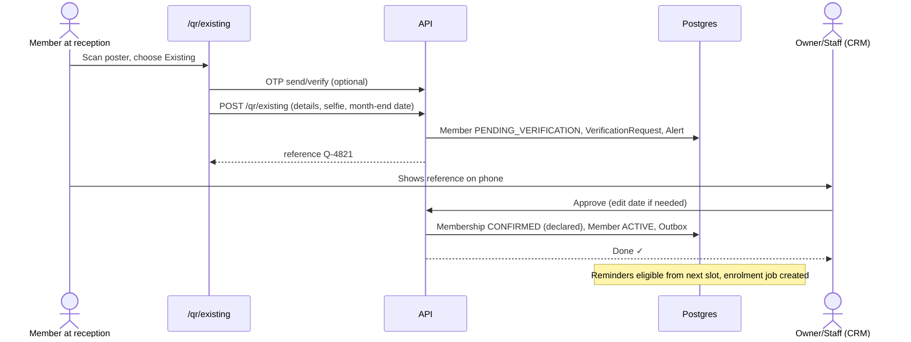
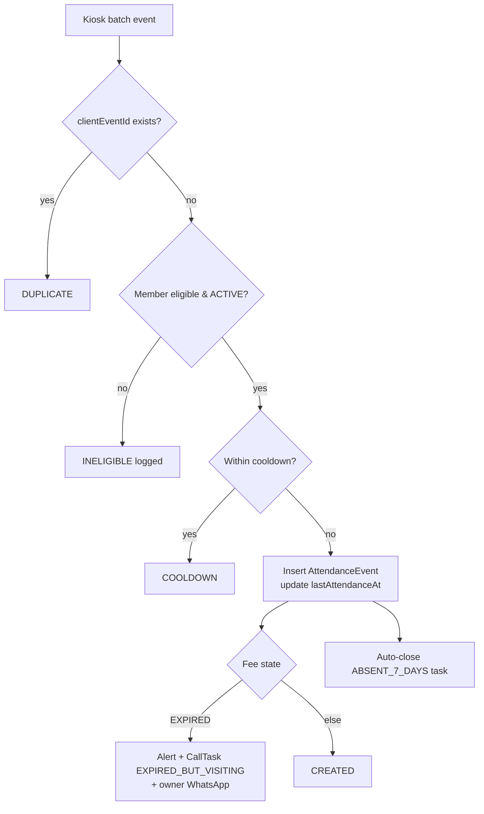
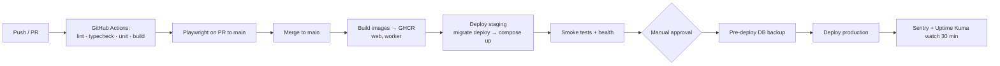
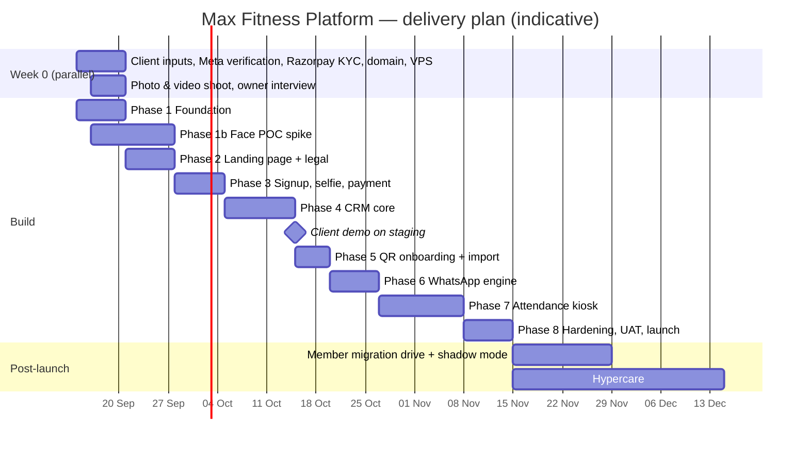

# Diagrams (Mermaid)

Architecture context/container/component diagrams are in `docs/05-engineering/system-architecture.md`. Kiosk state machine and sync sequence are in `attendance-face-recognition-system.md`. This file holds the remaining cross-cutting diagrams.

## 1. Entity-relationship (core)

## 2. Member lifecycle

## 3. Fee state (derived, per day)

## 4. Online sign-up & payment sequence

## 5. Reminder slot & unsubscribe sequence

## 6. QR existing-customer verification

## 7. Attendance ingest (server side)

## 8. Deployment pipeline

## 9. Roadmap (Gantt)

